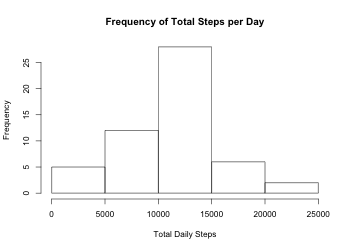
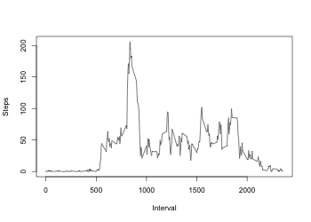
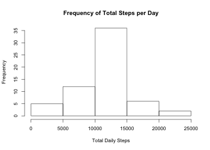
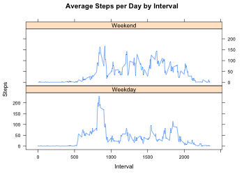

# Reproducible Research: Peer Assessment 1


## Loading and preprocessing the data

Dowload File from Coursera Website and Read into activedata Variable 

```r
activedata <- read.csv("~/activity.csv")
```

Explore Dataset and Preprocess Data
Convert date factor variables to dates

```r
activedatadates <- as.Date(activedata$date)
```


## What is mean total number of steps taken per day?
Part 1: Calculate the total number of steps taken per day. 

```r
totalsteps <- aggregate(steps ~ date, activedata, sum)
head(totalsteps)
```

```
##         date steps
## 1 2012-10-02   126
## 2 2012-10-03 11352
## 3 2012-10-04 12116
## 4 2012-10-05 13294
## 5 2012-10-06 15420
## 6 2012-10-07 11015
```
Part 2: Make a histogram of the total number of steps taken per day. 

```r
stephist <- hist(totalsteps$steps, 
                 main = "Frequency of Total Steps per Day",  
                 xlab = "Total Daily Steps", 
                  ylab = "Frequency")
```

<!-- -->

Part 3: Calculate the Mean and Median Total Steps Per Day

```r
mean(totalsteps$steps)
```

```
## [1] 10766.19
```

```r
median(totalsteps$steps)
```

```
## [1] 10765
```


## What is the average daily activity pattern?
Part 1: Make a time series plot i.e.(type = "l") of the 5 minute interval (x-axis) and the average number of steps taken, averaged across all days.

```r
stepinterval <- aggregate(steps ~ interval, activedata, mean)
plot(stepinterval$interval,stepinterval$steps, type = "l", xlab = "Interval", ylab = "Steps")
```

<!-- -->

Part 2: Which 5 minute interval on average across all days in the dataset, contains the maximum number of steps?

```r
stepinterval[which.max(stepinterval$steps), 1]
```

```
## [1] 835
```


## Imputing missing values
Part 1: Calculate and report the total number of missing values in the dataset (i.e. the total number of rows with 𝙽𝙰s)

```r
sum(is.na(activedata))
```

```
## [1] 2304
```

Part 2 & 3:Devise a strategy for filling in all of the missing values in the dataset. The strategy does not need to be sophisticated. For example, you could use the mean/median for that day, or the mean for that 5-minute interval, etc.

Create a new dataset that is equal to the original dataset but with the missing data filled in.

Solution: Using a non sophisticated strategy for filling in all of the missing values in the dataset. If a 5-minute interval has missing value, we use the mean for that 5-minute interval.

Created a new dataset equal to the original called activeimpute.


```r
activeimpute <- activedata
na.val<-is.na(activeimpute$steps)
int_avg <- tapply(activeimpute$steps, activeimpute$interval, mean, na.rm=TRUE, simplify=T)
activeimpute$steps[na.val] <- int_avg[as.character(activeimpute$interval[na.val])]
```

Part 4: Make a histogram of the total number of steps taken each day and Calculate and report the mean and median total number of steps taken per day. Do these values differ from the estimates from the first part of the assignment? What is the impact of imputing missing data on the estimates of the total daily number of steps?

```r
totalstepsimpute <- aggregate(steps ~ date, activeimpute, sum)
stephistimpute <- hist(totalstepsimpute$steps, 
                        main = "Frequency of Total Steps per Day",  
                        xlab = "Total Daily Steps", 
                        ylab = "Frequency")
```

<!-- -->
Mean Total Steps per Day

```r
mean(totalstepsimpute$steps)
```

```
## [1] 10766.19
```
Median Total Steps per Day

```r
median(totalstepsimpute$steps)
```

```
## [1] 10766.19
```
Based on the above calculations, there was some change in the median number of steps, however no change in the mean value. 


## Are there differences in activity patterns between weekdays and weekends?
Part 1: Create a new factor variable in the dataset with two levels – “weekday” and “weekend” indicating whether a given date is a weekday or weekend day.


```r
weekdays <- c("Monday", "Tuesday", "Wednesday", "Thursday", 
              "Friday")
activeimpute$weekday = as.factor(ifelse(is.element(weekdays(as.Date(activeimpute$date)),weekdays), "Weekday", "Weekend"))
```

Part 2: Make a panel plot containing a time series plot (i.e. 𝚝𝚢𝚙𝚎 = "𝚕") of the 5-minute interval (x-axis) and the average number of steps taken, averaged across all weekday days or weekend days (y-axis). See the README file in the GitHub repository to see an example of what this plot should look like using simulated data.


```r
stepintervalimpute <- aggregate(steps ~ interval + weekday, activeimpute, mean)

library(lattice)

xyplot(stepintervalimpute$steps ~ stepintervalimpute$interval|stepintervalimpute$weekday, main="Average Steps per Day by Interval",xlab="Interval", ylab="Steps",layout=c(1,2), type="l")
```

<!-- -->
More activity overall on weekends. More activity early on weekdays. 
